# UI Design

## Wireframe

1. Landing Page ( Search bar on top with option to choose filters ) -> This flows into Ranking Page
   Personalized Page -> suggestions for the user.
3. Ranking Page ( The result of search from the user chosen filters/ Result from the landing page )
   Map Integration -> Maps Embed API. Add a Google Map to your site without code or quota limits.
4. Create Account Page ( Users can create accounts, once created it will redirect to edit profile page where users can add information )
5. Edit Profile Page ( Users can add preferences )
6. Leave User Review Page
7. Page for each restaurant ( Overview type )
   Map Integration -> Maps Embed API. Add a Google Map to your site without code or quota limits.
8. Favourites Page ( User favourited restaurants )

### Wireframe 1

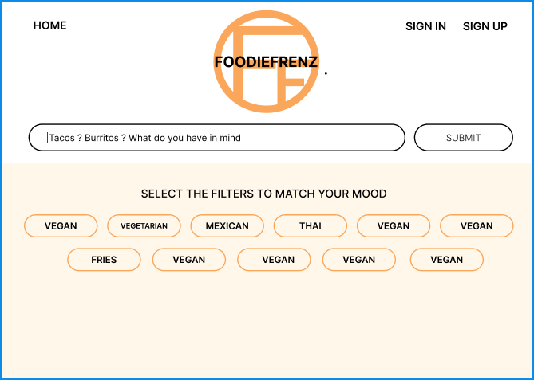

This is the landing page of the restaurant that users first see. It has a search bar so users can search for specifics they want and there are also potential filters they can use.

### Wireframe 2
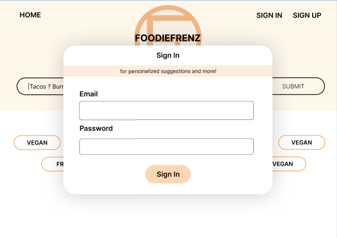

Our second wireframe is our sign in page where users can log in with their credentials.

### Wireframe 3
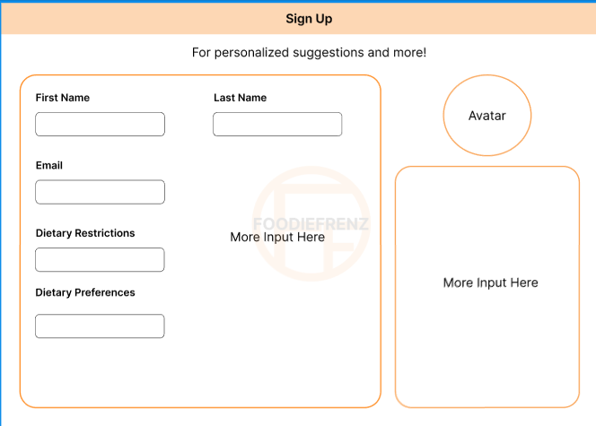

This wireframe shows the sign up page where users can create a new account. 

### Wireframe 4
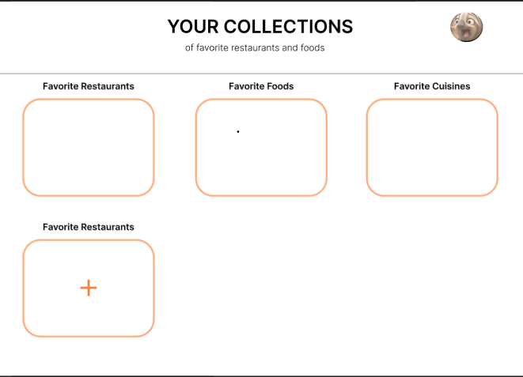

In this page, users are able to collect their favorite foods, restaurants, and make their own lists

### Wireframe 5
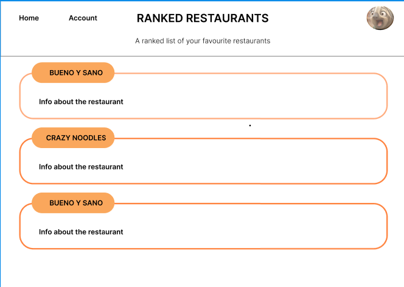

In this wireframe, it shows the restaurant in a ranked order so users can see the best recommendations

### Wireframe 6
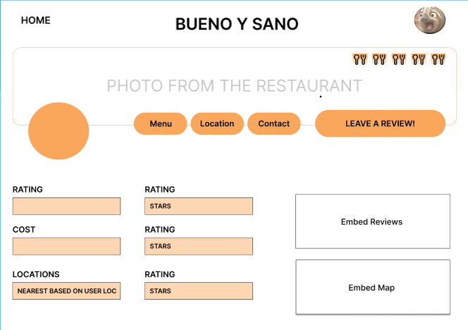

This wireframe is the main page of a restaurant where users can see all the info from a restaurant including rating, cost, menu, location, contact, and more. 

### Wireframe 7
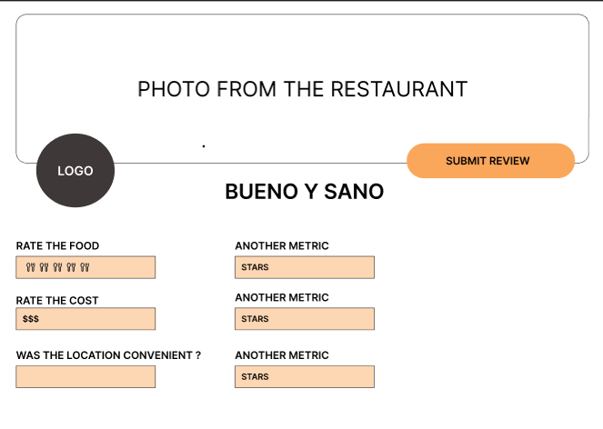

In this wireframe it shows the page where users are able to leave their own review and rank specific items and the restaurant as a whole.

## Stories

### Story 1
Rajj, a french fry fanatic, went to "Fry World", a local restaurant that serves fried foods, and had the worst experience. Not only was the service bad, but the fries were served practically frozen and had zero seasoning.

He navigates to our application "FoodieFrenz" and is met with the landing page where he searches up "Fry World". From here he is redirected to a ranking page that has "Fry World" at the top and related restaurants ranked below. Clicking on "Fry World" brings up the restaurant's individual page. From there he clicks on the restaurant's review tab and since Rajj is already logged onto his FoodieFrenz account, when he clicks the "leave a review" button it automatically brings up a leave user review page. From there he can click a button to specify whether he wants to review the restaurant or a specific food item from the restaurant. Now he can give a star rating out of 5, as well as a description/explanation for his review, also with the option to attach photos to his review.

### Story 2
Bob is a new user who is looking to use FoodieFrenz in order to find the best chicken tenders available in his area, but doesn't know where to start. However, he is a harsh critic, and has a lot of specific criteria to look for the best restaurant that will match his needs, which include being five miles away, the restaurant being over 3 stars, and being less than $10. On the landing page, he is able to use the main filtering system in order to get the restaurants with these descriptions, with different categories that he has chosen, from type of food, the proximity of the location from him (5 miles away) and the range of rating he would like to have. After entering his criteria he is given a list of restaurants, with McDonalds and Burger King being the best choices for him. 

After entering his criteria he is given a list of restaurants, with McDonalds and Burger King being the best choices for him, and can now get satisfactory chicken tenders.

### Story 3

A user, Jasmine, is a chicken sandwich lover and she is eager to share her favorite chicken sandwiches with her friend, Nikki. This is why she loves using FoodieFrenz's favorites and collections list.

Whenever she finds a restaurant she likes, she is able to search it up, find the item in the menu, and heart it. This automatically adds it to her favorites list.
In order to find her list, she can go to the upper right hand corner and click on her profile. Underneath her profile, there is a section called "My Collections". Once selected, there is an automatic lists with all Favorites from hearting items. 

There is also other collections that can be manually created. It can be created by clicking on the "+" sign and then providing a name for the collection. Jasmine is able to create as many categories as she wants to sho her friends. There is also an option to make the collection public or private. This way Jasmine has control over who is able to see her collections.

## HTML & CSS Mockup

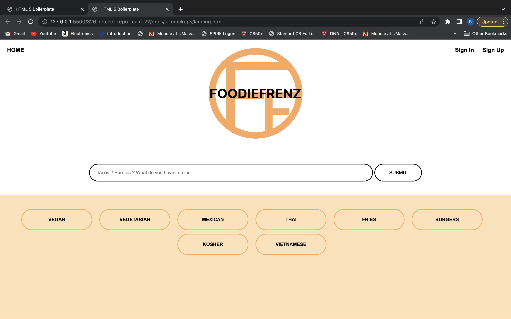

This is the current UI for our landing page.

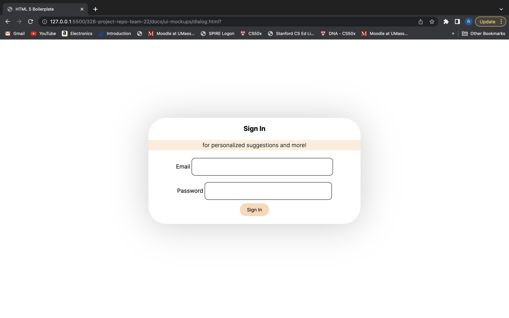

This is the current UI for our sign up popup.

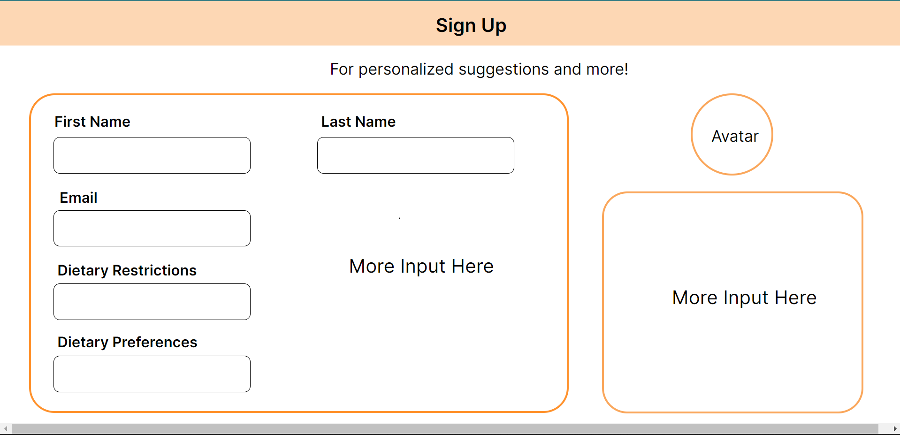

This is our current layout for the sign up page for our website.

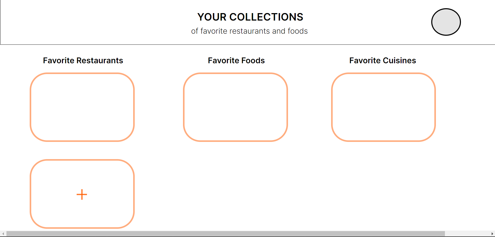

This is the current UI for our Your Collections page.

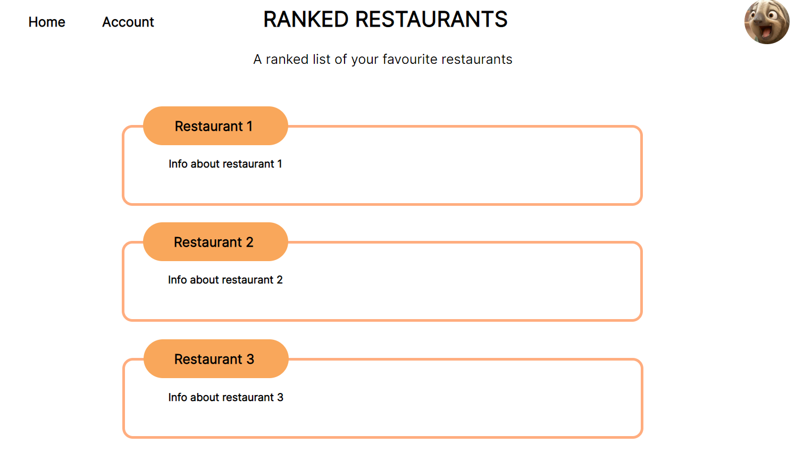

This is the current UI for our Ranked Restaurants page.

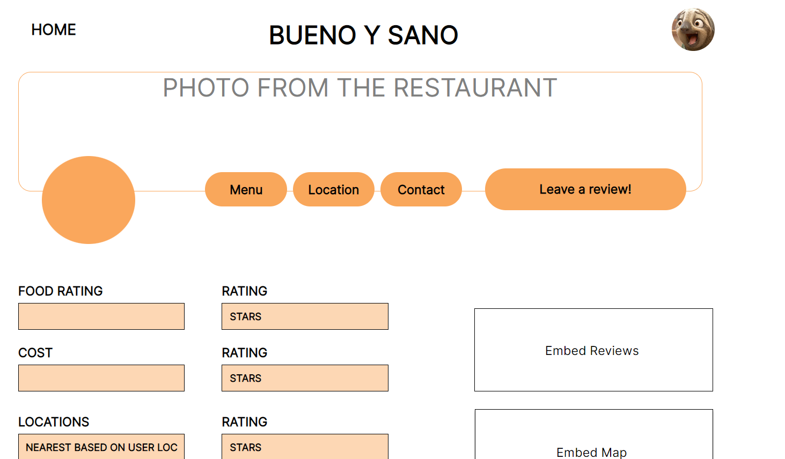

This is the current UI for our Restaurant Homepage.

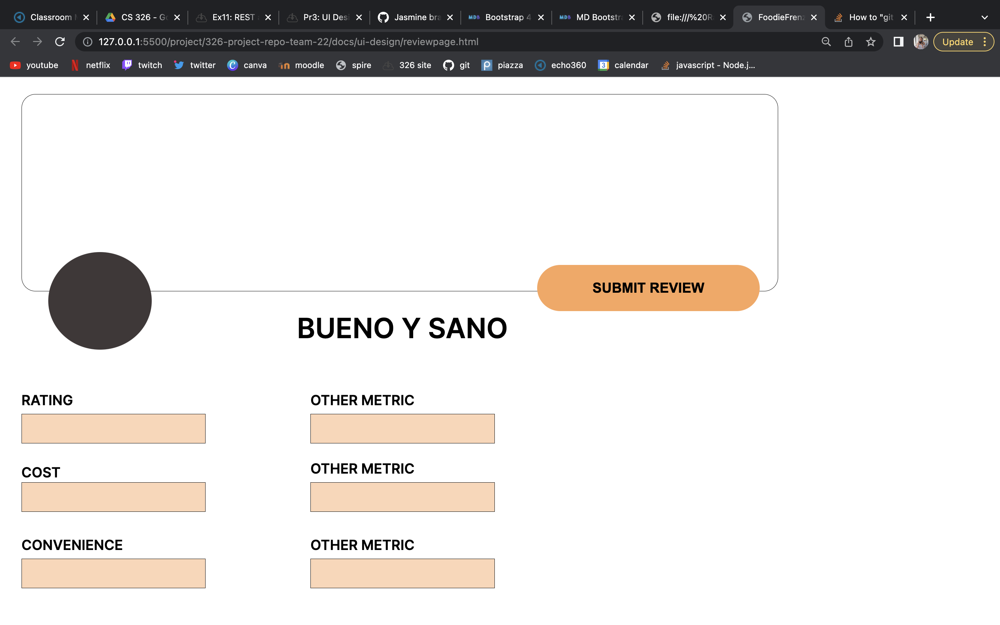

This is the current UI for the Leave User Review page.

## References
- [Link 1: Yelp](https://www.yelp.com/)
- [Link 2: Doordash](https://www.doordash.com/)
- [Link 3: GrubHub](https://www.grubhub.com/)

